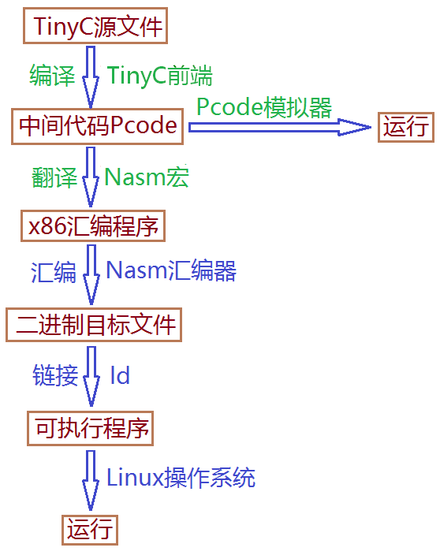

# TinyC

Write your own compiler.

https://pandolia.net/tinyc/

https://www.bookstack.cn/books/pandolia-tinyc

## 自己动手写编译器

#### 第1章 概述

编译器是将一种程序（源程序）翻译成另一种程序（目标程序）的计算机程序。本书介绍一个非常简单的编译器（ TinyC 编译器）的实现。

TinyC 编译器可将 TinyC 源程序编译成 Linux 下的可执行程序，其编译及运行基本流程如下图，首先利用 TinyC 前端将 TinyC 源程序编译成中间代码 Pcode ，再利用 Nasm 的宏程序将 Pcode 翻译成 x86（32位） 汇编指令，然后利用 Nasm 汇编成二进制目标程序，最后链接成 Linux 下的 32 位可执行程序，可直接在 Linux 下运行。另外，中间代码 Pcode 也可以用 Pcode 模拟器直接运行。

上图中绿色部分的 TinyC 前端、 Nasm 宏以及 Pcode 模拟器为由本人编程实现的部分，其他则是利用了 Nasm 和 ld 来生成可执行的二进制机器码。本书将 Nasm 宏、 Nasm 汇编器、 ld 链接器一起称为 TinyC 后端，将 TinyC 前端和 TinyC 后端一起称为 TinyC 编译器。

#### 第2章 源程序 TinyC

